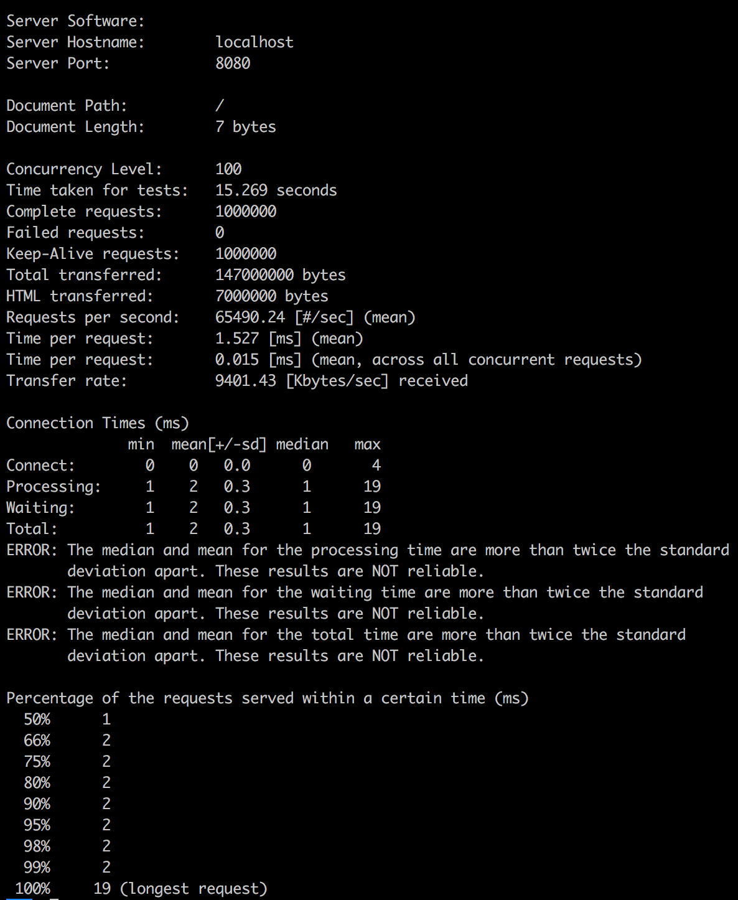

#seqgen-go
seqgen(https://github.com/dawnsea/seqgen)의 go-lang 버전 입니다. seqgen과는 다르게 memcached는 지원하지 않습니다.
go-lang 공부용으로 뚝딱 만든 것이기 때문에 상용으로 사용하시는 것은 강력하게 비추합니다.

## Requirement
go-lang 1.7.3 (http://golang.org)

## Setup
go-lang workspace 구축이 되어 있어야함 (workspace 구축은 https://golang.org/doc/code.html을 참조)
seqgen-go는 workspace의 src 폴더 밑에 위치시켜야 함

## Build
```
go install seqgen-go
```

## Test
```
go test -v
```

## Run
```
./seqgen-go
open http://localhost:8080
```

## Performance test
use apache ab or jmeter  

```
# example (concurrency: 100, request: 100,000)
ab -c 100 -n 100000 http://localhost:8080/
```


## License

